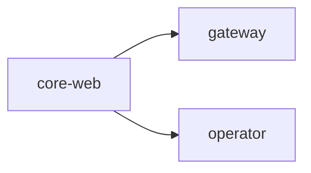

# blackroad-os

# BlackRoad OS · Orchestrator

Welcome to the meta-orchestration layer for the BlackRoad ecosystem. This repository
describes the constellation of services, packs, and environments that make up the platform.

Run `pnpm br-orchestrate render` to regenerate this README based on `orchestra.yml`.

## Service Matrix
| Service | Env | Repo | URL | Health | Depends |
| --- | --- | --- | --- | --- | --- |
| core-web | prod | core | https://web.blackroad.io | /api/health | gateway, operator |

## Packs
- education
- infra-devops
- creator-studio
- finance
- legal
- research-lab

## Environments
| Environment | Domain Root |
| --- | --- |
| dev | dev.blackroad.io |
| prod | blackroad.io |

## Topology

