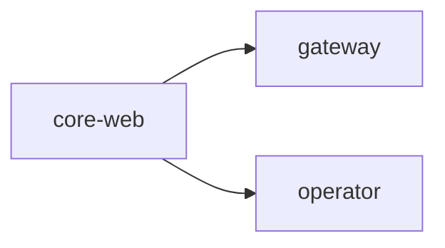

# BlackRoad OS · Orchestrator

Welcome to the meta-orchestration layer for the BlackRoad ecosystem. This repository
describes the constellation of services, packs, and environments that make up the platform.

Run `pnpm br-orchestrate render` to regenerate this README based on `orchestra.yml`.

## Service Matrix
| Service | Env | Repo | URL | Health | Depends |
| --- | --- | --- | --- | --- | --- |
| core-web | prod | core | https://web.blackroad.io | /api/health | gateway, operator |

## Topology

## 🌈 Trinity System

### 🔴 RedLight Templates

**website** (6 templates)

- Black Road Os Ultimate (2) (`black-road-os-ultimate--2-`)
- Blackroad Architecture Visual (`blackroad-architecture-visual`)
- Blackroad Metaverse (`blackroad-metaverse`)
- Blackroad Ultimate (`blackroad-ultimate`)
- Blackroad Brand Take 2 (`blackroad-brand-take-2`)
- *...and 1 more*

**world** (12 templates)

- Blackroad 3d World (`blackroad-3d-world`)
- Blackroad Earth Biomes (`blackroad-earth-biomes`)
- Blackroad Earth Game (`blackroad-earth-game`)
- Blackroad Earth Real (`blackroad-earth-real`)
- Blackroad Earth Street (`blackroad-earth-street`)
- *...and 7 more*

**animation** (3 templates)

- Blackroad Animation (`blackroad-animation`)
- Blackroad Motion (`blackroad-motion`)
- Schematiq Animation (`schematiq-animation`)

**game** (1 templates)

- Blackroad Game (`blackroad-game`)

**design** (1 templates)

- Schematiq Page (`schematiq-page`)

### 💚 GreenLight

Project management and collaboration system enabled.

### 💛 YellowLight

Infrastructure orchestration system enabled.

