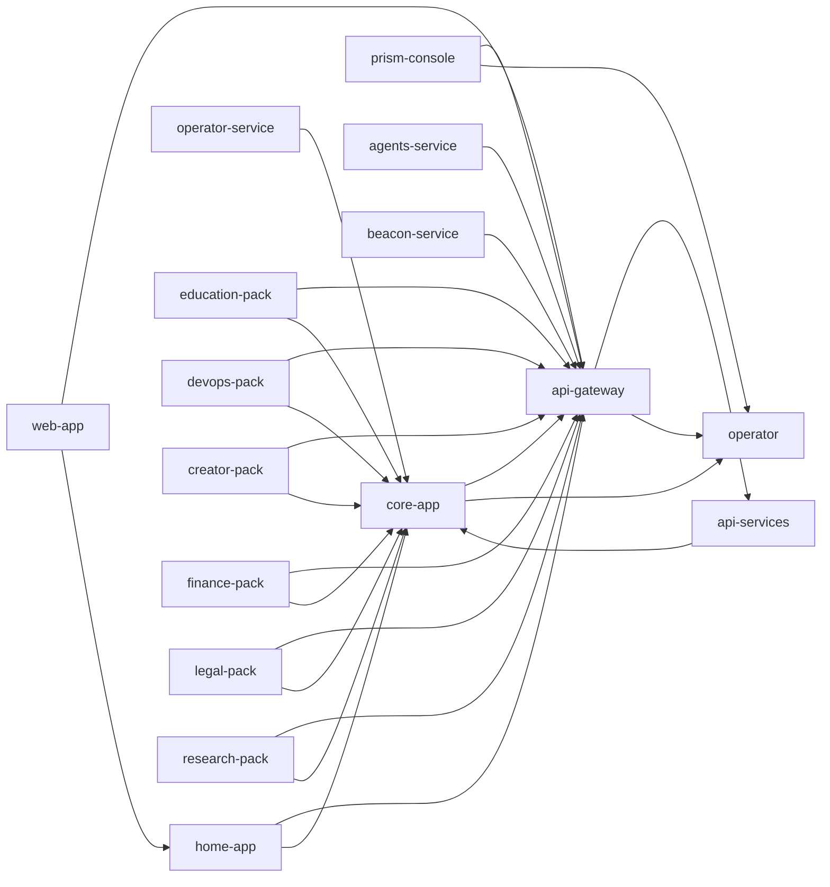

# blackroad-os

# BlackRoad OS · Orchestrator

Welcome to the meta-orchestration layer for the BlackRoad ecosystem. This repository
describes the constellation of services, packs, and environments that make up the platform.

📋 **[View Complete Repository Index (REPOS.md)](./REPOS.md)** – Single source of truth for all 24+ BlackRoad OS repositories

Run `pnpm br-orchestrate render` to regenerate this README based on `orchestra.yml`.

## 🌈 Light Trinity System

This repository includes the **Light Trinity System** - a unified intelligence, templating, and infrastructure framework:

- 🔴 **RedLight** - Template & Brand System (18+ HTML templates, brand guidelines)
- 💚 **GreenLight** - Project & Collaboration System (103 logging functions, multi-Claude coordination)
- 💛 **YellowLight** - Infrastructure & Deployment System (8,789+ Codex components, deployment automation)

**Quick Start:**
- View system overview: [`.trinity/README.md`](.trinity/README.md)
- Copilot instructions: [`.github/copilot-instructions-trinity.md`](.github/copilot-instructions-trinity.md)
- Create issues using Light Trinity templates in [`.github/ISSUE_TEMPLATE/`](.github/ISSUE_TEMPLATE/)

**Documentation:**
- RedLight: [`.trinity/redlight/docs/`](.trinity/redlight/docs/)
- GreenLight: [`.trinity/greenlight/docs/`](.trinity/greenlight/docs/)
- YellowLight: [`.trinity/yellowlight/docs/`](.trinity/yellowlight/docs/)

## Service Matrix
| Service | Env | Repo | URL | Health | Depends |
| Service | Env | Repo | URL | Health | Depends |
| --- | --- | --- | --- | --- | --- |
| os-meta | prod | meta | https://os.blackroad.systems | /health | — |
| core-app | prod | core | https://core.blackroad.systems | /api/health | api-gateway, operator |
| web-app | prod | web | https://web.blackroad.io | /api/health | api-gateway, home-app |
| home-app | prod | home | https://app.blackroad.io | /api/health | api-gateway, core-app |
| api-gateway | prod | gateway | https://api.blackroad.io | /health | api-services, operator |
| api-services | prod | api | https://services.blackroad.systems | /health | core-app |
| operator-service | prod | operator | https://operator.blackroad.systems | /health | core-app |
| prism-console | prod | prism | https://console.blackroad.io | /health | api-gateway, operator |
| agents-service | prod | agents | https://agents.blackroad.systems | /health | api-gateway |
| beacon-service | prod | beacon | https://status.blackroad.io | /health | api-gateway |
| education-pack | prod | pack-education | https://education.blackroad.systems | /health | api-gateway, core-app |
| devops-pack | prod | pack-devops | https://devops.blackroad.systems | /health | api-gateway, core-app |
| creator-pack | prod | pack-creator | https://studio.blackroad.systems | /health | api-gateway, core-app |
| finance-pack | prod | pack-finance | https://finance.blackroad.systems | /health | api-gateway, core-app |
| legal-pack | prod | pack-legal | https://legal.blackroad.systems | /health | api-gateway, core-app |
| research-pack | prod | pack-research | https://lab.blackroad.systems | /health | api-gateway, core-app |

## Packs
- education
- infra-devops
- creator-studio
- finance
- legal
- research-lab

## Environments
| Environment | Domain Root |
| --- | --- |
| dev | dev.blackroad.io |
| prod | blackroad.io |

## Topology

## 🌈 Trinity System

### 🔴 RedLight Templates

**website** (6 templates)

- Black Road Os Ultimate (2) (`black-road-os-ultimate--2-`)
- Blackroad Architecture Visual (`blackroad-architecture-visual`)
- Blackroad Metaverse (`blackroad-metaverse`)
- Blackroad Ultimate (`blackroad-ultimate`)
- Blackroad Brand Take 2 (`blackroad-brand-take-2`)
- *...and 1 more*

**world** (12 templates)

- Blackroad 3d World (`blackroad-3d-world`)
- Blackroad Earth Biomes (`blackroad-earth-biomes`)
- Blackroad Earth Game (`blackroad-earth-game`)
- Blackroad Earth Real (`blackroad-earth-real`)
- Blackroad Earth Street (`blackroad-earth-street`)
- *...and 7 more*

**animation** (3 templates)

- Blackroad Animation (`blackroad-animation`)
- Blackroad Motion (`blackroad-motion`)
- Schematiq Animation (`schematiq-animation`)

**game** (1 templates)

- Blackroad Game (`blackroad-game`)

**design** (1 templates)

- Schematiq Page (`schematiq-page`)

### 💚 GreenLight

Project management and collaboration system enabled.

### 💛 YellowLight

Infrastructure orchestration system enabled.

