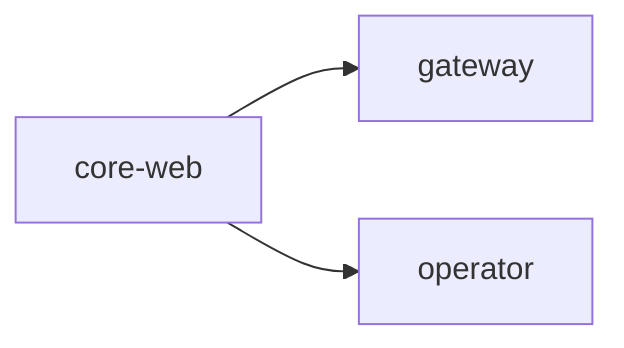

# BlackRoad OS · Orchestrator

Welcome to the meta-orchestration layer for the BlackRoad ecosystem. This repository
describes the constellation of services, packs, and environments that make up the platform.

Run `pnpm br-orchestrate render` to regenerate this README based on `orchestra.yml`.

## 🚦 Light Trinity System

This repository includes the **Light Trinity** system for unified development:

- **🟢 GreenLight** — Project management, features, workflows ([Issue Template](.github/ISSUE_TEMPLATE/greenlight_task.md))
- **🟡 YellowLight** — Infrastructure, deployment, CI/CD ([Issue Template](.github/ISSUE_TEMPLATE/yellowlight_infrastructure.md))
- **🔴 RedLight** — Visual templates, design, UX ([Issue Template](.github/ISSUE_TEMPLATE/redlight_template.md))

**BlackRoad Codex Integration:** Access 8,789+ reusable components via `.trinity/yellowlight/scripts/trinity-codex-integration.sh`

For full details, see [.trinity/README.md](.trinity/README.md) and [Copilot Instructions](.github/copilot-instructions.md).

## Service Matrix
| Service | Env | Repo | URL | Health | Depends |
| --- | --- | --- | --- | --- | --- |
| core-web | prod | core | https://web.blackroad.io | /api/health | gateway, operator |

## Topology

