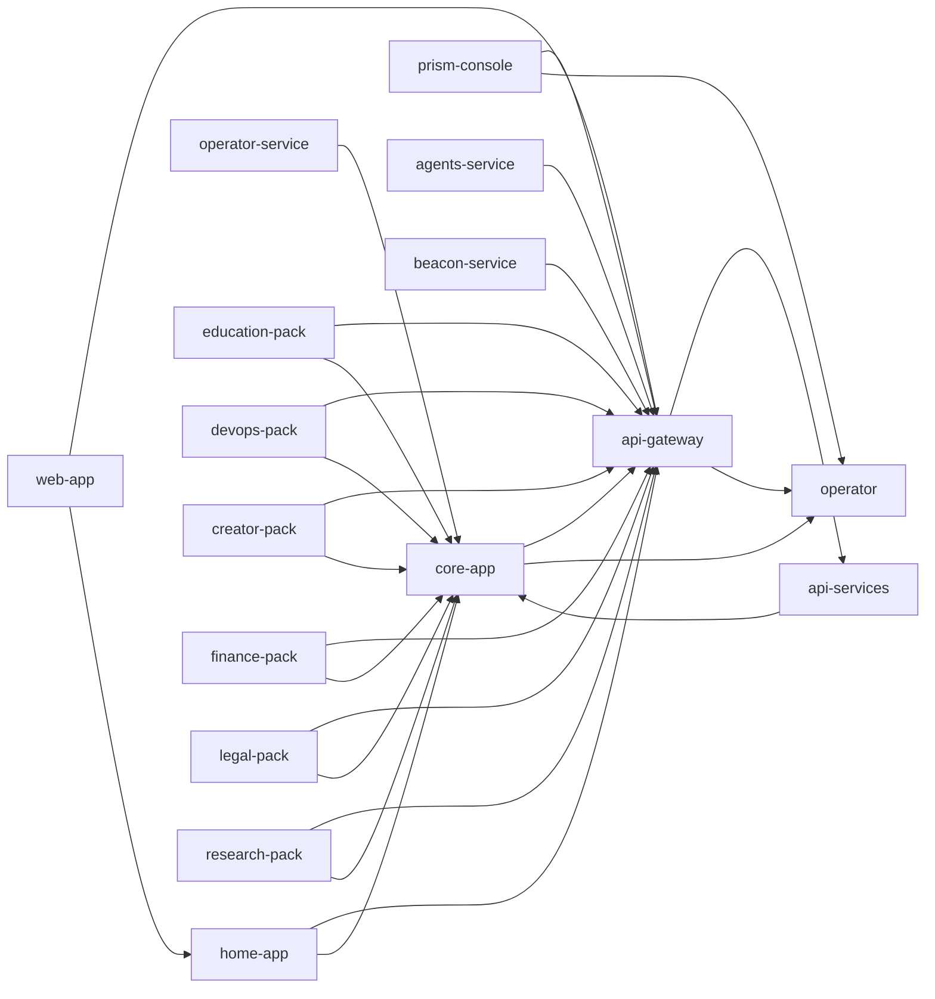

# BlackRoad OS · Orchestrator

Welcome to the meta-orchestration layer for the BlackRoad ecosystem. This repository
describes the constellation of services, packs, and environments that make up the platform.

📋 **[View Complete Repository Index (REPOS.md)](./REPOS.md)** – Single source of truth for all 24+ BlackRoad OS repositories

Run `pnpm br-orchestrate render` to regenerate this README based on `orchestra.yml`.

## Service Matrix
| Service | Env | Repo | URL | Health | Depends |
| --- | --- | --- | --- | --- | --- |
| os-meta | prod | meta | https://os.blackroad.systems | /health | — |
| core-app | prod | core | https://core.blackroad.systems | /api/health | api-gateway, operator |
| web-app | prod | web | https://web.blackroad.io | /api/health | api-gateway, home-app |
| home-app | prod | home | https://app.blackroad.io | /api/health | api-gateway, core-app |
| api-gateway | prod | gateway | https://api.blackroad.io | /health | api-services, operator |
| api-services | prod | api | https://services.blackroad.systems | /health | core-app |
| operator-service | prod | operator | https://operator.blackroad.systems | /health | core-app |
| prism-console | prod | prism | https://console.blackroad.io | /health | api-gateway, operator |
| agents-service | prod | agents | https://agents.blackroad.systems | /health | api-gateway |
| beacon-service | prod | beacon | https://status.blackroad.io | /health | api-gateway |
| education-pack | prod | pack-education | https://education.blackroad.systems | /health | api-gateway, core-app |
| devops-pack | prod | pack-devops | https://devops.blackroad.systems | /health | api-gateway, core-app |
| creator-pack | prod | pack-creator | https://studio.blackroad.systems | /health | api-gateway, core-app |
| finance-pack | prod | pack-finance | https://finance.blackroad.systems | /health | api-gateway, core-app |
| legal-pack | prod | pack-legal | https://legal.blackroad.systems | /health | api-gateway, core-app |
| research-pack | prod | pack-research | https://lab.blackroad.systems | /health | api-gateway, core-app |

## Topology

