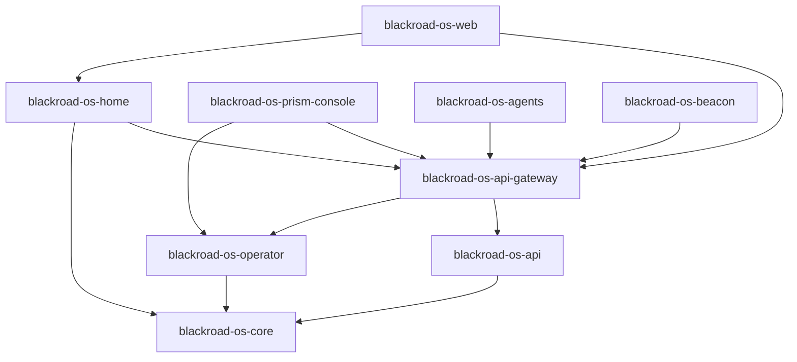

# BlackRoad OS Repository Index

> **📍 Single Source of Truth** for all BlackRoad OS repositories, their roles, domains, and relationships.

---

## Repository Organization

The BlackRoad OS ecosystem consists of 24+ repositories organized into four categories:

- **Core Services** – Essential runtime services
- **Infrastructure** – Platform & DevOps tooling
- **Product Packs** – Vertical business lines
- **Support** – Documentation, research, branding, and archives

---

## Core Services

Core services are the essential runtime components that power the BlackRoad OS platform.

| Repository | Subdomain | Role | Description | Status |
|------------|-----------|------|-------------|--------|
| `blackroad-os` | `os.blackroad.systems` | 🧠🧭 Org Brain & Map | Meta-orchestration layer, architecture docs, repo index | ✅ Active |
| `blackroad-os-core` | `core.blackroad.systems` | 🧠 Core Logic | Application brain, core business logic | ✅ Active |
| `blackroad-os-web` | `web.blackroad.systems` | 🎨 UI Shell | Web frontend, React components, user-facing UI | ✅ Active |
| `blackroad-os-home` | `home.blackroad.systems` | 🏠 Home Dashboard | User home dashboard and workspace | ✅ Active |
| `blackroad-os-api` | `services.blackroad.systems` | 🔌 API Services | REST/GraphQL endpoints, microservices | ✅ Active |
| `blackroad-os-api-gateway` | `api.blackroad.systems` | 🚪 API Gateway | API routing, authentication, rate limiting | ✅ Active |
| `blackroad-os-operator` | `operator.blackroad.systems` | ⚙️ Operator | Jobs, automation, cron tasks, orchestration | ✅ Active |
| `blackroad-os-prism-console` | `console.blackroad.systems` | 🕹️ Prism Console | Admin control plane, dashboards, monitoring | ✅ Active |

---

## Infrastructure

Infrastructure repositories handle platform operations, deployment, and development tooling.

| Repository | Subdomain | Role | Description | Status |
|------------|-----------|------|-------------|--------|
| `blackroad-os-infra` | `infra.blackroad.systems` | ☁️ Infrastructure | Cloudflare, Railway, DNS configs, IaC | ✅ Active |
| `blackroad-os-agents` | `agents.blackroad.systems` | 🤖 Agents | AI agents, automation bots, workflows | ✅ Active |
| `blackroad-os-beacon` | `beacon.blackroad.systems` | 🚨 Status Beacon | Health checks, status page, uptime monitoring | ✅ Active |

---

## Product Packs

Product packs are vertical business lines and specialized functionality modules.

| Repository | Subdomain | Role | Description | Status |
|------------|-----------|------|-------------|--------|
| `blackroad-os-pack-education` | `education.blackroad.systems` | 💼📚 Education Pack | Educational tools, courses, learning management | ✅ Active |
| `blackroad-os-pack-infra-devops` | `devops.blackroad.systems` | 💼⚙️ DevOps Pack | DevOps tools, CI/CD, infrastructure management | ✅ Active |
| `blackroad-os-pack-creator-studio` | `studio.blackroad.systems` | 💼🎨 Creator Studio | Content creation tools, media editing, publishing | ✅ Active |
| `blackroad-os-pack-finance` | `finance.blackroad.systems` | 💼💰 Finance Pack | Financial tools, accounting, invoicing, payments | ✅ Active |
| `blackroad-os-pack-legal` | `legal.blackroad.systems` | 💼⚖️ Legal Pack | Legal document management, compliance, contracts | ✅ Active |
| `blackroad-os-pack-research-lab` | `lab.blackroad.systems` | 💼🧪 Research Lab | R&D experiments, prototypes, innovation projects | ✅ Active |

---

## Support

Support repositories provide documentation, branding, research, and archival functions.

| Repository | Subdomain | Role | Description | Status |
|------------|-----------|------|-------------|--------|
| `blackroad-os-docs` | `docs.blackroad.systems` | 📚 Documentation | Extended documentation, guides, API reference | ✅ Active |
| `blackroad-os-research` | `research.blackroad.systems` | 🧪 Research | Experiments, R&D, innovation, prototypes | ✅ Active |
| `blackroad-os-brand` | `brand.blackroad.systems` | 🎨 Brand Assets | Logo, colors, design system, brand guidelines | ✅ Active |
| `blackroad-os-archive` | `archive.blackroad.systems` | 🧾 Archive | Historical data, logs, deprecated features | ✅ Active |
| `blackroad-os-demo` | `demo.blackroad.systems` | 🎮 Demo | Demos, sandboxes, showcase environments | ✅ Active |
| `blackroad-os-ideas` | `ideas.blackroad.systems` | 💡 Ideas | Feature requests, brainstorming, roadmap planning | ✅ Active |

---

## Repository Dependencies

### Core Service Dependencies

### Pack Dependencies

All product packs depend on:
- `blackroad-os-api-gateway` (for API access)
- `blackroad-os-core` (for core business logic)

---

## Environment Routing

Each repository can be deployed across multiple environments:

- **Production**: `<subdomain>.blackroad.systems`
- **Development**: `<subdomain>.dev.blackroad.systems`
- **Staging**: `<subdomain>.stg.blackroad.systems`
- **Sandbox**: `<subdomain>.sandbox.blackroad.systems`

### Public-Facing Aliases

The `blackroad.io` domain provides user-friendly aliases:

| Public Domain | Routes To | Purpose |
|---------------|-----------|---------|
| `blackroad.io` | `web.blackroad.systems` | Main marketing site |
| `app.blackroad.io` | `home.blackroad.systems` | User dashboard |
| `console.blackroad.io` | `console.blackroad.systems` | Admin console |
| `api.blackroad.io` | `api.blackroad.systems` | Public API |
| `docs.blackroad.io` | `docs.blackroad.systems` | Documentation |
| `status.blackroad.io` | `beacon.blackroad.systems` | Status page |

---

## Repository Naming Conventions

### Standard Prefixes

- `blackroad-os-` – Core OS repositories
- `blackroad-os-pack-` – Product pack repositories

### Subdomain Mapping

For any repository `blackroad-os-XYZ`, the default subdomain is `xyz.blackroad.systems`.

**Examples:**
- `blackroad-os-core` → `core.blackroad.systems`
- `blackroad-os-web` → `web.blackroad.systems`
- `blackroad-os-pack-education` → `education.blackroad.systems` (drops "pack-" prefix)

---

## Emoji Legend

| Emoji | Meaning |
|-------|---------|
| 🧠 | Core logic / architecture |
| 🧭 | Source of truth / map |
| 🏠 | Home / dashboard |
| 💼 | Vertical pack / product line |
| 📚 | Docs / knowledge |
| 🧪 | Research / experiments |
| ⚙️ | Operator / jobs / automation |
| 🔌 | API / endpoints |
| 🚪 | Gateway / routing |
| 🕹️ | Console / dashboards |
| ☁️ | Infra / DNS / environments |
| 🧾 | Archive / logs |
| 🎨 | Brand / design |
| 🤖 | Agents / bots |
| 🚨 | Status / monitoring |
| 💡 | Ideas / brainstorming |
| 🎮 | Demo / sandbox |
| 💰 | Finance / payments |
| ⚖️ | Legal / compliance |

---

## Maintenance

### Adding a New Repository

When creating a new BlackRoad OS repository:

1. **Name it**: Follow convention `blackroad-os-<name>` or `blackroad-os-pack-<name>`
2. **Register subdomain**: Add DNS for `<name>.blackroad.systems`
3. **Update this file**: Add entry to appropriate category
4. **Update orchestra.yml**: Add to repos and services sections
5. **Update .matrix.json**: Keep in sync with orchestra.yml
6. **Add to REPO_PERSONA.md**: Include in the repo index table

### Archiving a Repository

When archiving a repository:

1. Update status in this file to `⚠️ Archived`
2. Move content to `blackroad-os-archive` if needed
3. Keep DNS records but redirect to status page
4. Remove from active service definitions in orchestra.yml

---

## Quick Reference

**Total Repositories**: 24
- Core Services: 8
- Infrastructure: 3
- Product Packs: 6
- Support: 6
- Meta (this repo): 1

**Primary Domain**: `blackroad.systems`  
**Public Domain**: `blackroad.io`  
**Corporate Domain**: `blackroadinc.us`

---

*Last updated: 2026-01-23*  
*Powered by BlackRoad OS 🖤🛣️*
